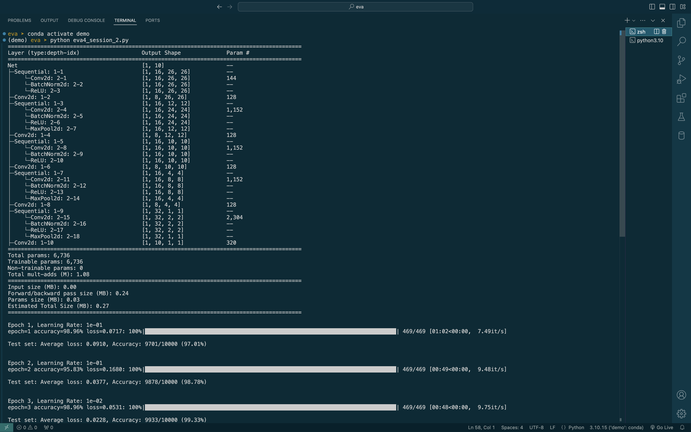
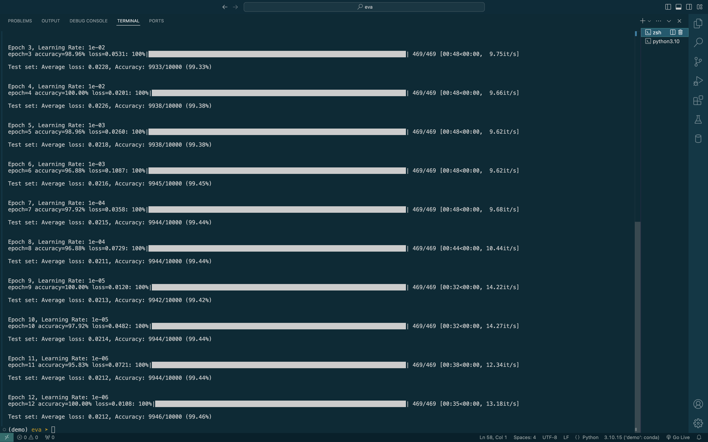

# MNIST Digit Classification with PyTorch

A convolutional neural network (CNN) implementation for MNIST digit classification using PyTorch. The model achieves >99.4% accuracy on the test set while maintaining a parameter count of 6736.

## Features

- Custom CNN architecture with optimized parameter count
- Data augmentation pipeline including:
  - Random perspective transformation
  - Random rotation
  - Random erasing
- Learning rate scheduling
- Misclassified samples visualization
- Automated testing pipeline
- CI/CD integration with GitHub Actions

## Requirements

Install the required packages using:

```bash
pip install -r requirements.txt
```

## Model Architecture

The model uses a series of custom blocks (CRBDP - Convolution, ReLU, BatchNorm, Dropout, Pool) with the following structure:

1. Input (28x28) → Block1 (26x26)
2. 1x1 Conv → Block2 (12x12)
3. 1x1 Conv → Block3 (10x10)
4. 1x1 Conv → Block4 (4x4)
5. 1x1 Conv → Block5 (1x1)
6. Final 1x1 Conv → Output (10 classes)

## Training

To train the model:

```bash
python train.py
```

The training process includes:
- 20 epochs, 6 epochs gives the desired result :)
- SGD optimizer with momentum and Nesterov acceleration
- Step learning rate scheduler
- Batch size of 128

### Training Progress





## Testing

Run the test suite:

```bash
python test.py
```

The tests verify:
1. Model parameter count (< 20,000 parameters)
2. Model accuracy (> 99.4% on test set)

## CI/CD

The project includes GitHub Actions workflow that:
- Sets up Python environment
- Installs dependencies
- Runs training with reduced epochs
- Executes test suite
- Reports results

Note: The code will generate misclassified samples during training as `misclassified_samples_1.png` and `misclassified_samples_20.png` (or the last epoch number). 

